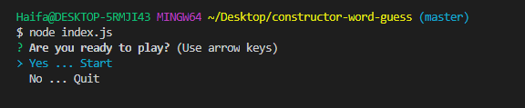
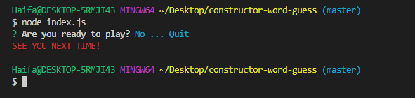
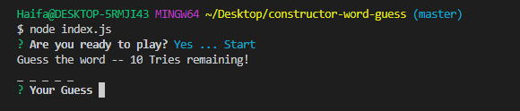
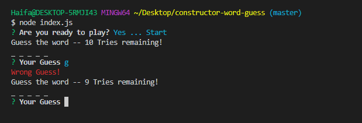
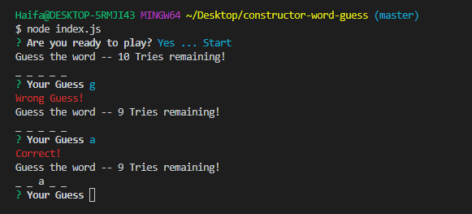
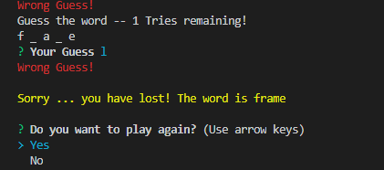
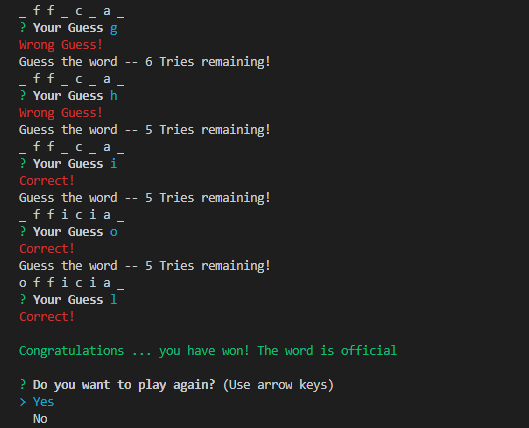

# constructor-word-guess

### Overview

In this app you will be guessing a word by typing letters. You will be notified if your guess is right or wrong. You have 10 tries, if you use all of them without guessing the word then you will lose.

1. **You can run the app using the below command line**.

```node index.js```



2. **You will be asked if you want to start the game or just quit**.

If you choose to quit, you will get the following message:



3. **If you choose to start, random blank words will start to be displayed for you to guess**:



4. **If you guessed a wrong letter, the following message will be displayed, and your tries will decrase by one**.



5. **If you guessed the right letter, the following message will be displayed**.



6. **If you used all of your tries without guessing the letter, you will lose, the correct letter will be dispplayed and you will be asked if you want to play again**.



7. **If you choose to quit, the game will end and if you choose to play again, a new blank word will be displayed to be gussed**.

8. **If you guessed all the letters of the word correctly, you will win and the correct word will be displayed. Also, you will be asked if you want to play again or just quit the game**.

